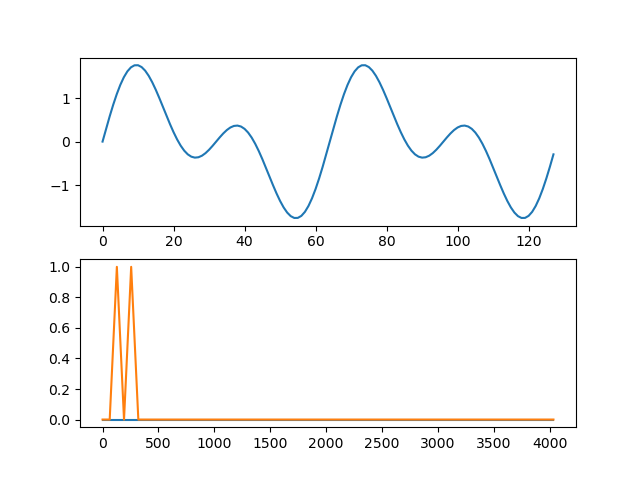

# Testing

## Testing with toy signal
In this test we replicate the results of a demostration of [Darko Lukic's code](https://gist.github.com/lukicdarkoo/1ab6a9a7b24025cb428a), we yet have to understand, explain and verify if the output is indeed correct. 
### Steps
1. Generate the toy input file (make sure to be in testing directory to use the exact lines below in terminal)
```
gcc generate_input_time.c -lm
./a.out
```
2. Calculate the fftw with fftw2-mpi_helloworld.c
```
mpicc ../fftw3-mpi_helloworld.c -lfftw3_mpi -lfftw3 -lm -lmpich -Wall
mpiexec -n 4 ./a.out 128 test_input.iq out.iq
```
3. Plot. The first plot is in the time domain, and the second in the frecuency domain.
```
python plt.py 
```
